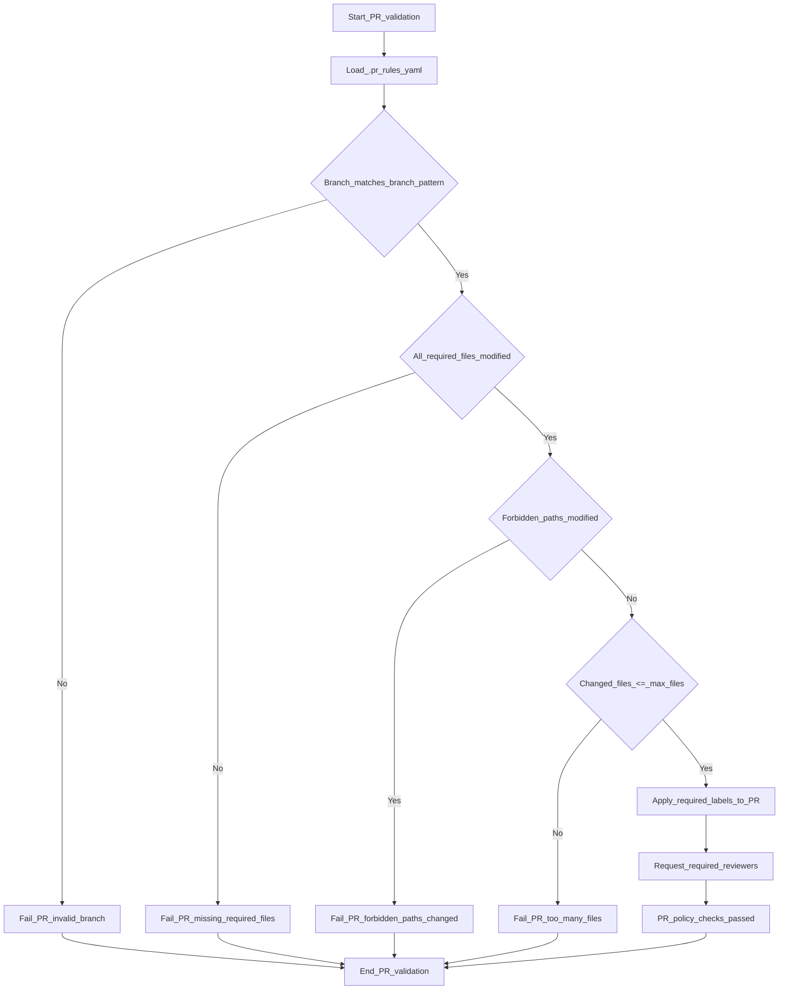

## Howto approach

>  Enhance process optimizations (GitOps)
>  
>  Shift Left:  Start security testing early.
>    
>  Automate: Integrate containers and report audit logs into CI/CD.
>   
>  Collaborate: Align all teams on security goals
>  

## Enhance GitOps - Process changes to apply

Adjust CI workflow to preserve a PR feature log artifact instead of commenting the Terraform plan on the PR.

 • Remove github-script-based step that reads tf-summarize and posts it as a PR comment.
 
 • Add shell step that, for pull_request events, copies /mnt/data/pr-feature-log into $GITHUB_WORKSPACE/pr-feature-log if it exists.
  
 • Keep Terraform apply execution unchanged after the new log copy step.

Add PR rules configuration to enforce branch naming, touched files, forbidden paths, file count, required labels, and reviewers. 

• Introduce .pr_rules.yaml with a regex enforcing feature/ branches containing a CRLZ ticket id. 

• Require that docs/architecture.md and modules/network/README.md are modified in the PR

• Disallow changes under prod-secrets/ and GitOps paths. 

• Limit PRs to a maximum of 50 changed files. 

• Define all required_labels (architecture, cr:review) and required_reviewers (arch-team) for PR automation or validation.

Add a pr-feature-log file at the repo root to integrate with CI diagnostics. 

• Create new pr-feature-log file to be copied into the workspace during CI for pull requests. 

• Prepare groundwork for external process or tooling that writes diagnostics to /mnt/data/pr-feature-log via a pr-feature-log file descriptors



## Activate CodeQL scanning per environment and language

These CodeQL alerts are displayed in the repository “Security” tab on the code scanning page:

Press enter or click to view image in full size


> Integrate CodeQL into GitOps

    krisdevops@TopGun-X3:/tmp/codeql$ ./codeql database print-baseline db
    Counted a baseline of 11071 lines of code for javascript.

## Specific Shift Left Tactics

### **Automated Issue Creation with GitHub REST API and use containers**

In order to automate issue creation, I had to create a new workflow that would query the  [GitHub Rest API](https://docs.github.com/en/rest?apiVersion=2022-11-28)  and generate the necessary issues.

1.  First, I obtained a list of all of the existing CodeQL alerts with a GET request.
2.  Then I created a second GET request to check if there are any existing issues created for the CodeQL alerts obtained from step 1.
3.  Lastly, I used a POST request to automatically generate issues for any alerts without associated issues.

### **Python creates a summary package and uses Allure reporting for baseline and threshold measurements**


    root@TopGun-X3:~# npm install -g allure-commandline --save-dev  
    added 1 package, and audited 2 packages in 4s
    
    found 0 vulnerabilities
    
    root@TopGun-X3:~# npm install -g allure-commandline --save-dev > basic_testpackage_py.txt
    root@TopGun-X3:~# vi basic_testpackage_py.txt

    echo "------------------------------------------------------------"
    echo "Post Flight Check - Argocd CD Expose Post Operations"
    echo "------------------------------------------------------------"
    
    kubectl create configmap cluster-state \
    --from-file=cluster-state.json
    
    kubectl get configmap cluster-state -o json
    
    ARGO_XHEADERS=$(curl -sk -X POST https://argocd.local:8080/api/v1/session \
    
    -H "Content-Type: application/json" | jq -r 'cluster_state.json')
    
    export $ARGO_XHEADERS

### *Reporting*
> Setup python dependencies and promote via terraform, output the report section 

```

- name: Setup Python
uses: actions/setup-python@v4

with:

python-version: "3.10"

# Panda, wheel and dependencies are crucial, unit tested working-directory
- name: Install Python dependencies
working-directory: .
run: |
	python -m pip install --upgrade pip	
	python -m pip install pandas setuptools wheel
if [ -f requirements.txt ]; then
	python -m pip install -r requirements.txt
fi  

# Cucumber-js will be installed and configured next to this, making sure the frame is vast
- name: Run Basic Tests for any further integration with Core Python
run: |
	if ls test_*.py >/dev/null 2>&1; then
	pytest test_datalz22.py
echo "Python tests executed"
else
echo "No Python tests found — skipping"
fi

- name: Run Tests with Coverage

run: |
pip install pytest-cov
pytest --cov=. --cov-report=xml
#!/usr/bin/env bash
set -euo pipefail

- name: Check dependencies for the data workload planes (Imesh)

run: |
echo "🔍 Checking AKS module folder"
[ -d "./gitops/infra/aks" ] || { echo "AKS module missing"; exit 0; }
echo "🔧 Validating Terraform module

terraform init -backend=false
terraform validate

echo "📦 Checking required manifests"  

for f in .gitops/infra/deploy/manifests/*.yaml; do
[ -f "$f" ] || { echo "Missing mesh manifest: $f"; exit 0; }
done
echo "✅ Data mesh dependency check passed"

```

### *Embrace team collaboration and alignments*

Simplify Outputs and finalize your codeql cluster.state file 

> Create peace of mind within development teams

 Deploy using argocd the latest features

> Parse Outputs JSON Content-Types as Post Flight Checks


    echo "------------------------------------------------------------"
    
    echo "Post Flight Check - Argocd CD Expose Post Operations"
    
    echo "------------------------------------------------------------"
    
    kubectl create configmap cluster-state \
    
    --from-file=cluster-state.json
    
    kubectl get configmap cluster-state -o json
    
    ARGO_XHEADERS=$(curl -sk -X POST https://argocd.local:8080/api/v1/session \
    
    -H "Content-Type: application/json" | jq -r 'cluster_state.json')
    
    export $ARGO_XHEADERS

### *Addendum*
### > Granular AKS Policies

> Coming Soon!
[AKS exhaustive List and Release Notes](./policies.md)

