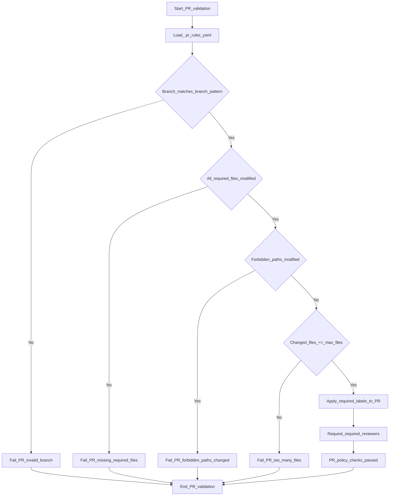

# FeatureBranch-MVP-AWS Draft Version

How-to approach?

> Shift Left: Start security testing early.
> 
> Automate: Integrate security tools into CI/CD.
> 
> Collaborate: Align all teams on security goals.

## Drafted solution blocks, initiate process AWS onboarding 

  Create a GoldenPath within core AWS
  
>     > krisdevops@TopGun-X3:~/.aws$ ls amazonq  aws_vault.sh  config 
>     > credentials  node_modules  package-lock.json  package.json  sso
>     > krisdevops@TopGun-X3:~/.aws$

 ## Recommendations as per my own developed CIv2 (Cloud Adoption Framework):

 - [x] Test and setup AWS Cli conform BP
       - 
 - [x] Configure dry-run modus to limit control spending
              - 
 - [x] Test setup instance VPC (Virtual Private Endpoint)
                     - 
 - [x] Configure EC2 instance with appropriate security groups and IAM
       roles, shutdown after testing
                            - 
 - [x] Configure CloudTrail to monitor and log all API activity in the
       AWS environment
                                   - 
 - [x] Script via bash a baseline to control and govern audit logs
       safely and secure
                                          - 
 - [x] Configure IAM to allow only included roles , selectively 5 max
                                                 - 
 - [x] Make sure to test all components and ensure they are working
       correctly before  proceeding with the project.
                                                    
 - [x] Document the setup process and any configurations made for future reference of updates and or new solutions
 - [ ]  Regularly review and update the AWS environment to ensure it remains secure and efficient for production workloads as the product or project evolves.


## Gathering phasis 2 - Enhance data and audit logging on your default profile

>
>  AUDIT_LOG="${AUDIT_LOG:-$HOME/.aws/aws-vault-audit.log}"
> 
>  die() {
>      echo "ERROR: $*" >&2
>      audit_log "ERROR" "$*" "1"
>      exit 1  }
> 
>  audit_log() {
>      local status="$1"
>      local message="$2"
>      local exitcode="${3:-0}"
> 
>      local timestamp
>      timestamp="$(date -u +"%Y-%m-%dT%H:%M:%SZ")"
> 
>      local identity="unknown"
>      if command -v aws >/dev/null 2>&1; then
>          identity="$(aws sts get-caller-identity --output json 2>/dev/null || echo 'unavailable')"
>      fi
> 
>      printf "%s | profile=%s | status=%s | exit=%s | cmd=%s | identity=%s\n" \
>          "$timestamp" "$PROFILE" "$status" "$exitcode" "$CMD_STRING" "$identity" \
>          >> "$AUDIT_LOG"  }
>         >> "$AUDIT_LOG"
> }

# Specific Security Policy

## Adapted Versions

# CodeQL scanning per language, infused by GH action and functions
>
> Coming soon add-on co-written feature
>

1. ql output ? via JSON best !

Finalize your codeql cluster.state file and deploy with argo-cd the latest features

E.g as per below header manipulation

     echo "------------------------------------------------------------"
      echo "Post Flight Check - Argocd CD Expose Post Operations"
    echo "------------------------------------------------------------"
    
    kubectl create configmap cluster-state \
    --from-file=cluster-state.json
    
    kubectl get configmap cluster-state -o json
    
    ARGO_XHEADERS=$(curl -sk -X POST https://argocd.local:8080/api/v1/session \
    
    -H "Content-Type: application/json" | jq -r 'cluster_state.json')
    
    export $ARGO_XHEADERS


2. Upload zip coming from data-main.yaml

3. github/actions and developed functions

```
- name: Commit changes
        uses: stefanzweifel/git-auto-commit-action@v5
        with:
            commit_message: "Update README with latest Terraform summary"

```
 

# Python creates a summary package and uses Allure reporting for baseline and threshold measurements

´´´

root@TopGun-X3:~# npm install -g allure-commandline --save-dev

added 1 package, and audited 2 packages in 4s

found 0 vulnerabilities
root@TopGun-X3:~# npm install -g allure-commandline --save-dev > basic_testpackage_py.txt
root@TopGun-X3:~# vi basic_testpackage_py.txt

´´´

> Setup python dependencies and promote via terraform, output the report section

```
    - name: Setup Python
        uses: actions/setup-python@v4
        with:
          python-version: "3.10"

      # Panda, wheel and dependencies are crucial, unit tested working-directory
      - name: Install Python dependencies
        working-directory: .
        run: |
          python -m pip install --upgrade pip
          python -m pip install pandas setuptools wheel
          if [ -f requirements.txt ]; then
            python -m pip install -r requirements.txt
          fi

      # Cucumber-js will be installed and configured next to this, making sure the frame is vast
      - name: Run Basic Tests for any further integration with Core Python
        run: |
          if ls test_*.py >/dev/null 2>&1; then
            pytest test_datalz22.py
            echo "Python tests executed"
          else
            echo "No Python tests found — skipping"
          fi

      - name: Run Tests with Coverage
        run: |
          pip install pytest-cov
          pytest --cov=. --cov-report=xml
          #!/usr/bin/env bash
          set -euo pipefail

      - name: Check dependencies for the data workload planes (Imesh)
        run: |
          echo "🔍 Checking AKS module folder"
           [ -d "./gitops/infra/aks" ] || { echo "AKS module missing"; exit 0; }

          echo "🔧 Validating Terraform module"

          terraform init -backend=false
          terraform validate

          echo "📦 Checking required manifests"

          for f in .gitops/infra/deploy/manifests/*.yaml; do
            [ -f "$f" ] || { echo "Missing mesh manifest: $f"; exit 0; }
          done
          echo "✅ Data mesh dependency check passed"
```

# Policies applied to AKS
[AKS exhaustive List and Release Notes](./policies.md)


# Org Wide security activation for selected repositories and best practices service mesh 


