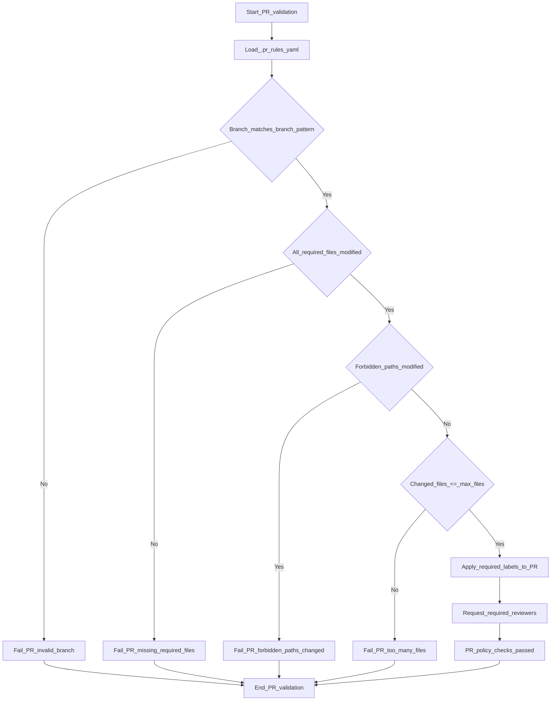

# FeatureBranch-MVP-AWS Draft Version

How-to approach?

> Shift Left: Start security testing early.
> Automate: Integrate security tools into CI/CD.
> Collaborate: Align all teams on security goals.

## Drafted solution blocks, initiate process AWS onboarding 

  Create a GoldenPath within core AWS
  
>     > krisdevops@TopGun-X3:~/.aws$ ls amazonq  aws_vault.sh  config 
>     > credentials  node_modules  package-lock.json  package.json  sso
>     > krisdevops@TopGun-X3:~/.aws$

 ## Recommendations as per my own developed CIv2 (Cloud Adoption Framework):

 - [x] Test and setup AWS Cli conform BP
       - 
 - [x] Configure dry-run modus to limit control spending
              - 
 - [x] Test setup instance VPC (Virtual Private Endpoint)
                     - 
 - [x] Configure EC2 instance with appropriate security groups and IAM
       roles, shutdown after testing
                            - 
 - [x] Configure CloudTrail to monitor and log all API activity in the
       AWS environment
                                   - 
 - [x] Script via bash a baseline to control and govern audit logs
       safely and secure
                                          - 
 - [x] Configure IAM to allow only included roles , selectively 5 max
                                                 - 
 - [ ] Make sure to test all components and ensure they are working
       correctly before  proceeding with the project.
                                                    
 - [ ] Document the setup process and any configurations made for future reference of updates and or new solutions
 - [ ]  Regularly review and update the AWS environment to ensure it
              remains secure and efficient for production workloads as the                                   project evolves.

## Gathering phasis 2 - Enhance data and audit logging on your default profile

>  AUDIT_LOG="${AUDIT_LOG:-$HOME/.aws/aws-vault-audit.log}"
> 
>  die() {
>      echo "ERROR: $*" >&2
>      audit_log "ERROR" "$*" "1"
>      exit 1  }
> 
>  audit_log() {
>      local status="$1"
>      local message="$2"
>      local exitcode="${3:-0}"
> 
>      local timestamp
>      timestamp="$(date -u +"%Y-%m-%dT%H:%M:%SZ")"
> 
>      local identity="unknown"
>      if command -v aws >/dev/null 2>&1; then
>          identity="$(aws sts get-caller-identity --output json 2>/dev/null || echo 'unavailable')"
>      fi
> 
>      printf "%s | profile=%s | status=%s | exit=%s | cmd=%s | identity=%s\n" \
>          "$timestamp" "$PROFILE" "$status" "$exitcode" "$CMD_STRING" "$identity" \
>          >> "$AUDIT_LOG"  }
         >> "$AUDIT_LOG"
 }

# Specific Security Policy

## Adapted Versions

Changes made 

Adjust CI workflow to preserve a PR feature log artifact instead of commenting the Terraform plan on the PR.	
•	Remove github-script-based step that reads tf-summarize and posts it as a PR comment.
•	Add shell step that, for pull_request events, copies /mnt/data/pr-feature-log into $GITHUB_WORKSPACE/pr-feature-log if it exists.
•	Keep Terraform apply execution unchanged after the new log copy step.	

Add PR rules configuration to enforce branch naming, touched files, forbidden paths, file count, required labels, and reviewers.	
•	Introduce .pr_rules.yaml with a regex enforcing feature/ branches containing a CRLZ ticket id.
•	Require that docs/architecture.md and modules/network/README.md are modified in the PR.
•	Disallow changes under prod-secrets/ and GitOps paths.
•	Limit PRs to a maximum of 50 changed files.
•	Define all required_labels (architecture, cr:review) and required_reviewers (arch-team) for PR automation or validation.

Add a pr-feature-log file at the repo root to integrate with CI diagnostics.	
•	Create new pr-feature-log file to be copied into the workspace during CI for pull requests.
•	Prepare groundwork for external process or tooling that writes diagnostics to /mnt/data/pr-feature-log via a pr-feature-log file descriptor

## Reporting a Vulnerability

✔️ Option A — Email the maintainers

Check README files or metadata manifests

✔️ Option B — Open an issue (only if the vulnerability is NOT sensitive)

# Policies applied to AKS
[AKS exhaustive List and Release Notes](./policies.md)

# Org Wide security activation for selected repositories and best practices service mesh 

# CodeQL scanning per environment and language

These CodeQL alerts are displayed in the repository “Security” tab on the code scanning page:

> Press enter or click to view image in full size

## **Automating Issue Creation with GitHub REST API**

In order to automate issue creation, I had to create a new workflow that would query the  [GitHub Rest API](https://docs.github.com/en/rest?apiVersion=2022-11-28)  and generate the necessary issues.

1.  First, I obtained a list of all of the existing CodeQL alerts with a GET request.
2.  Then I created a second GET request to check if there are any existing issues created for the CodeQL alerts obtained from step 1.
3.  Lastly, I used a POST request to automatically generate issues for any alerts without associated issues.

## Python creates a summary package and uses Allure reporting for baseline and threshold measurements

    root@TopGun-X3:~# npm install -g allure-commandline --save-dev  
    added 1 package, and audited 2 packages in 4s
    
    found 0 vulnerabilities
    
    root@TopGun-X3:~# npm install -g allure-commandline --save-dev > basic_testpackage_py.txt
    root@TopGun-X3:~# vi basic_testpackage_py.txt

